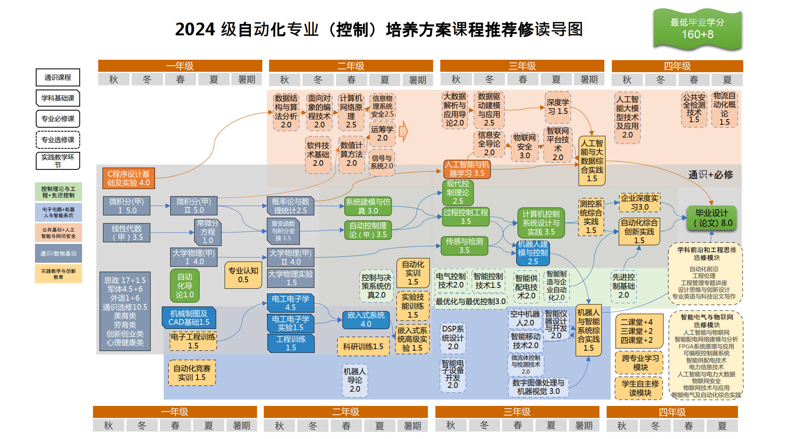

# 培养方案

## 培养方案
<iframe src="pdf/2024auto.pdf#navpanes=0" 
        width="100%" height="600px" 
        style="border: none; overflow: auto;">
    您的浏览器不支持 PDF 查看，请下载 PDF 文件: 
    <a href="pdf/2024auto.pdf">下载 PDF</a>
</iframe>

    <strong>如需离线查看或保存该文件，请点击以下链接：</strong>
    <a href="pdf/2024auto.pdf">下载 PDF 文件</a>

## 思维导图

为了帮助学生更好地理解课程结构和培养目标，学院绘制了思维导图以直观地展示了各个核心课程之间的关系。如有任何疑问，欢迎随时联系学长学姐或加入我们的QQ咨询群，获取更多信息和建议！

