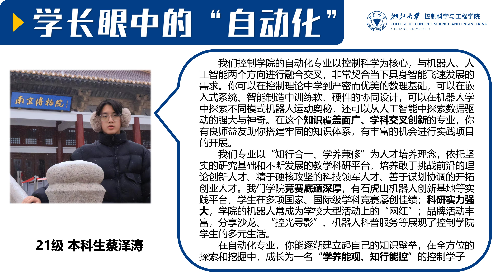
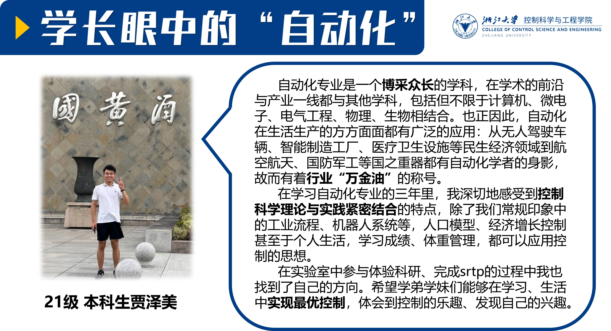
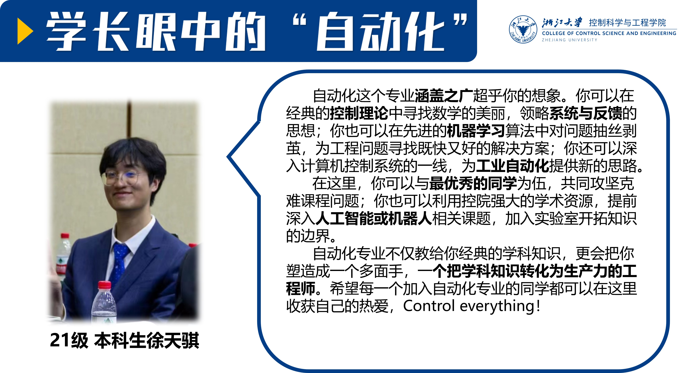
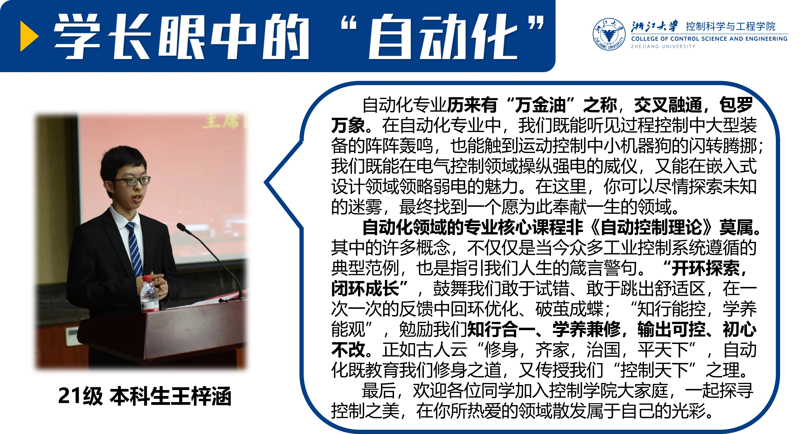
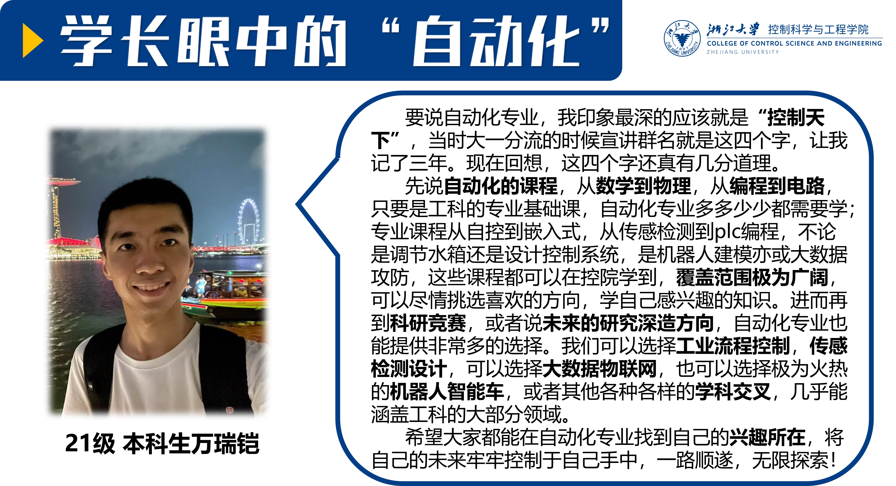
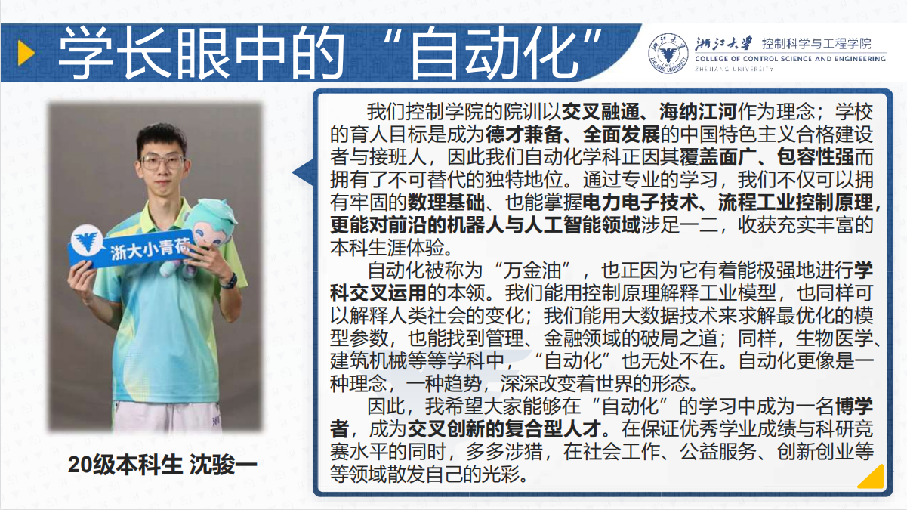
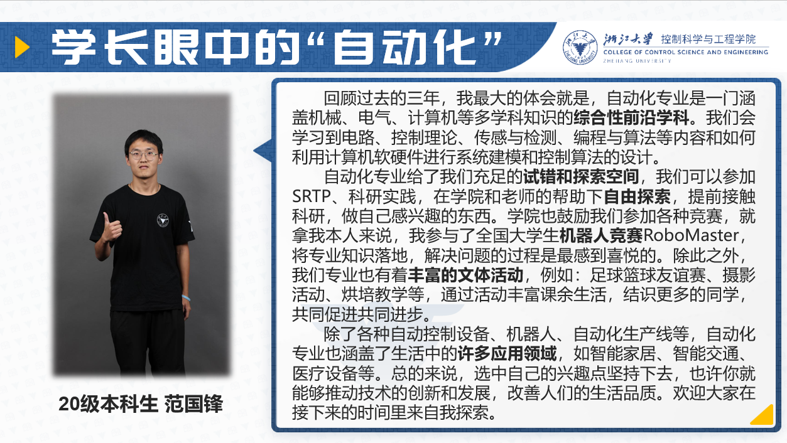
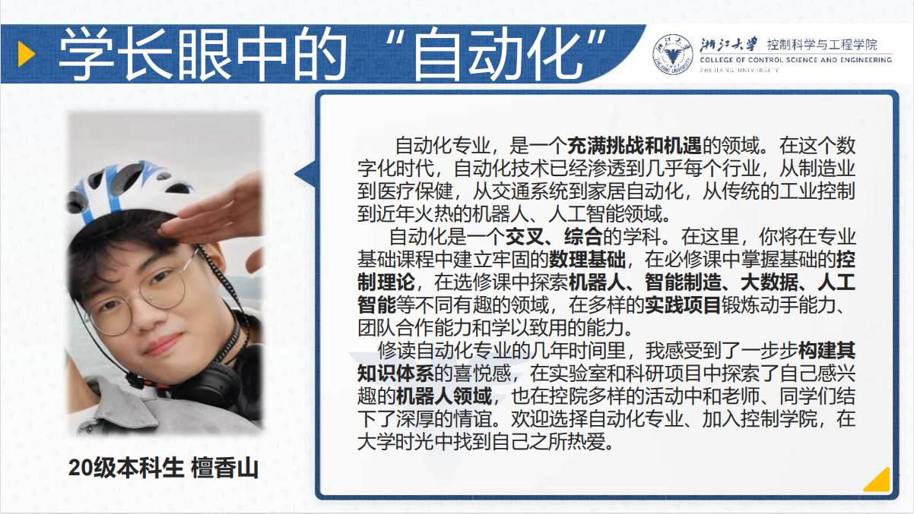
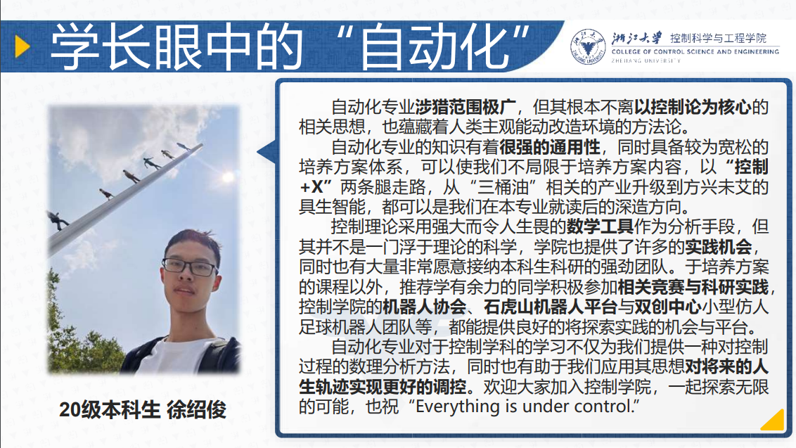
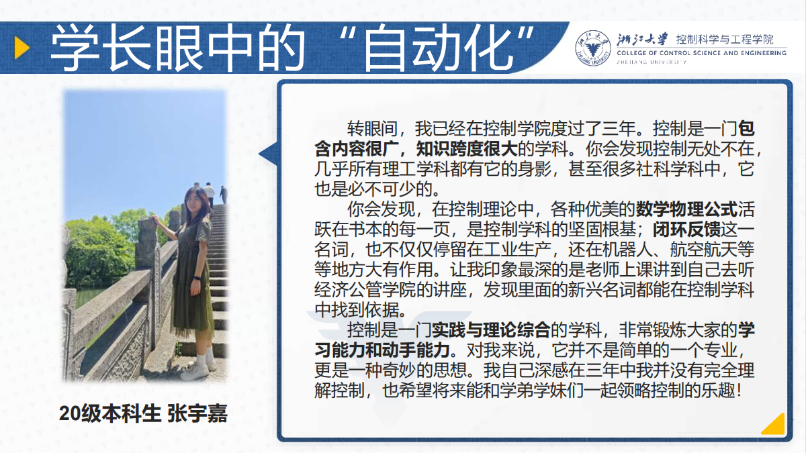

# 专业介绍

我们邀请了优秀学长以视频和文字的形式为大家分享他们的经验和见解，学长们将结合自己的学习经历，详细介绍自动化专业的独特特点、课程设置以及未来的就业方向和发展前景。

## 学长讲专业

    
2020级本科生 朱少廷

    <video style="width: 80%; height: auto; display: block; margin: auto;" controls loop>
        <source src="video/2023zst.mp4" type="video/mp4">
        您的浏览器不支持该视频播放，请升级您的浏览器。
    </video>
     
    
2023级研究生 周靳

    <video style="width: 80%; height: auto; display: block; margin: auto;" controls loop>
        <source src="video/2023zj.mp4" type="video/mp4">
        您的浏览器不支持该视频播放，请升级您的浏览器。
    </video>
     
    
2018级本科生 忻铄

    <video style="width: 80%; height: auto; display: block; margin: auto;" controls loop>
        <source src="video/2023xs.mp4" type="video/mp4">
        您的浏览器不支持该视频播放，请升级您的浏览器。
    </video>

## 学长眼中的“自动化”

    
    
    
    
    
    
    
    
    
    
    
    

<!-- 

    

        
        
        
        
        
        
        
        
        
        
        
        
    

    

        <button class="button" onclick="prevSlide()">❮</button>
        <button class="button" onclick="nextSlide()">❯</button>
    

 -->